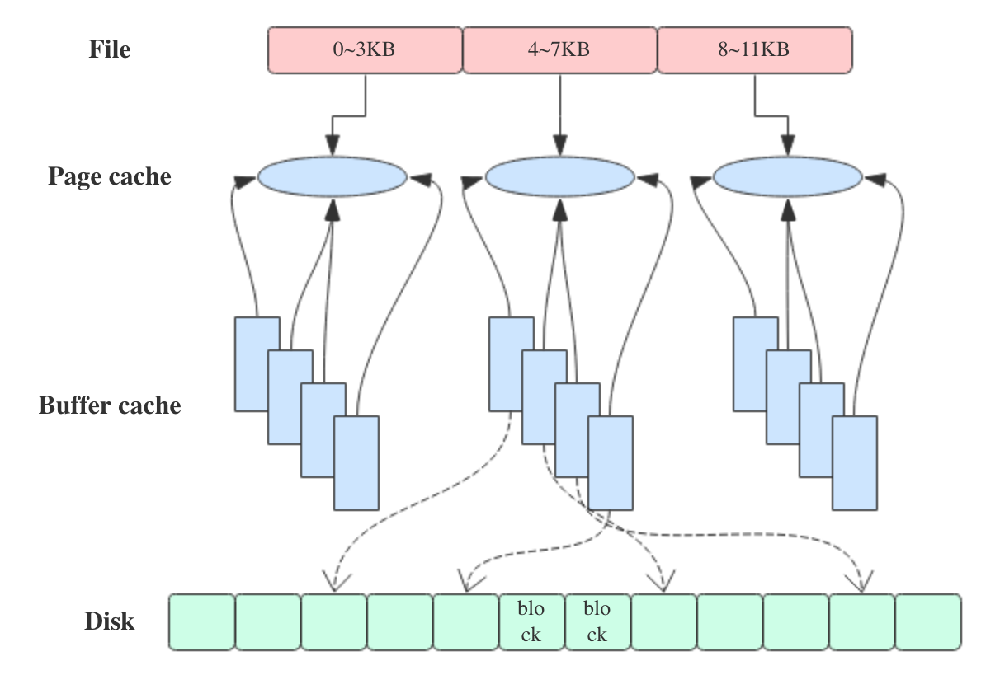
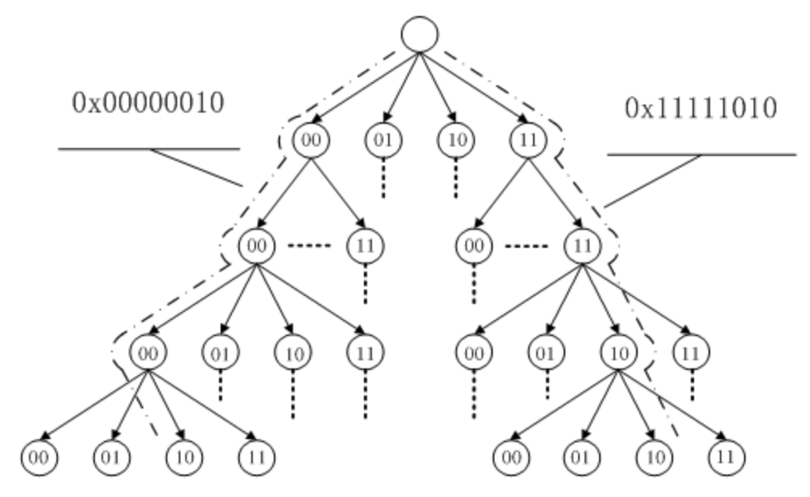

# Page Cache

## 1. 操作系统的 page cache 与 buffer cache 之间的关系

执行 free 命令，注意到会有两列名为 buffers 和 cached，也有一行名为 “-/+ buffers/cache”。

```bash
~ free -m
             total       used       free     shared    buffers     cached
Mem:        128956      96440      32515          0       5368      39900
-/+ buffers/cache:      51172      77784
Swap:        16002          0      16001
```

其中，cached 列表示当前的页缓存（page cache）占用量，buffers 列表示当前的块缓存（buffer cache）占用量。用一句话来解释：**page cache 用于缓存文件的页数据，buffer cache 用于缓存块设备（如磁盘）的块数据。**页是逻辑上的概念，因此 page cache 是与文件系统同级的；块是物理上的概念，因此 buffer cache 是与块设备驱动程序同级的。

其中，cached 列表示当前的页缓存（page cache）占用量，buffers 列表示当前的块缓存（buffer cache）占用量。用一句话来解释：**page cache 用于缓存文件的页数据，buffer cache 用于缓存块设备（如磁盘）的块数据。**页是逻辑上的概念，因此 page cache 是与文件系统同级的；块是物理上的概念，因此 buffer cache 是与块设备驱动程序同级的。

page cache 与 buffer cache 的共同目的都是加速数据 I/O：写数据时首先写到缓存，将写入的页标记为 dirty，然后向外部存储 flush，也就是缓存写机制中的 write-back（另一种是 write-through，Linux 未采用）；读数据时首先读取缓存，如果未命中，再去外部存储读取，并且将读取来的数据也加入缓存。操作系统总是积极地将所有空闲内存都用作 page cache 和 buffer cache，当内存不够用时也会用 LRU 等算法淘汰缓存页。

在 Linux 2.4 版本的内核之前，page cache 与 buffer cache 是完全分离的。但是，块设备大多是磁盘，磁盘上的数据又大多通过文件系统来组织，这种设计导致很多数据被缓存了两次，浪费内存。所以在 2.4 版本内核之后，两块缓存近似融合在了一起：如果一个文件的页加载到了 page cache，那么同时 buffer cache 只需要维护块指向页的指针就可以了。只有那些没有文件表示的块，或者绕过了文件系统直接操作（如dd命令）的块，才会真正放到 buffer cache 里。因此，我们现在提起 page cache，基本上都同时指 page cache 和 buffer cache 两者，本文之后也不再区分，直接统称为 page cache。

下图近似地示出 32-bit Linux 系统中可能的一种 page cache 结构，其中 block size 大小为 1KB，page size 大小为 4KB。



page cache 中的每个文件都是一棵基数树（radix tree，本质上是多叉搜索树），树的每个节点都是一个页。根据文件内的偏移量就可以快速定位到所在的页，如下图所示。关于基数树的原理可以参见[英文维基](https://links.jianshu.com/go?to=https%3A%2F%2Fen.wikipedia.org%2Fwiki%2FRadix_tree)，这里就不细说了。



## 2. page cache 与预读

操作系统为基于 page cache 的读缓存机制提供预读机制（PAGE_READAHEAD），一个例子是：用户线程仅仅请求读取 PAGE 0，但是操作系统却向当前线程的 page cache 中缓存了 PAGE0、PAGE1、PAGE2、PAGE3。

操作系统进行一次 I/O 读写的数据量不是任意的，而是依赖于 page 的具体大小。大多数操作系统的（包括 32 bits 以及 64 bits 系统）page 大小都被配置为 4KB。

下图代表了操作系统的预读机制：


## 3. page cache 与文件一致性

现代 Linux 的 page cache 正如其名，是对磁盘上 page（页）的内存缓存，同时可以用于读/写操作。一切内存缓存都存在一致性问题：内存中的数据与磁盘中的数据不一致，例如用作分布式中间件缓存的 Redis 就与 MySQL 等数据库中的数据存在不一致。

Linux 提供多种机制来保证数据一致性，但无论是单机上的内存与磁盘一致性，还是分布式组件中节点 1 与节点 2 、节点 3 的数据一致性问题，理解的关键是 trade-off：吞吐量与数据一致性保证是一对矛盾。

首先，需要我们理解一下文件的数据。文件 = 数据 + 元数据。元数据用来描述文件的各种属性，也必须存储在磁盘上。因此，我们说保证文件一致性其实包含了两个方面：数据一致+元数据一致。

> 文件的元数据包括：文件大小、创建时间、访问时间、属主属组等信息。

我们考虑如下一致性问题：如果发生写操作并且对应的数据在 page cache 中，那么写操作就会直接作用于 page cache 中，此时如果数据还没刷新到磁盘，那么内存中的数据就领先于磁盘，此时对应 page 就被称为 Dirty page。

当前 Linux 下以两种方式实现文件一致性：

1. 向用户层提供特定接口，可调用接口来主动地保证文件一致性；
2. 系统中存在定期任务（表现形式为内核线程），周期性地同步文件系统中文件脏数据块；

上述两种方式最终都依赖于系统调用，主要分为如下三种系统调用：

| 方法              | 含义                                                         |
| ----------------- | ------------------------------------------------------------ |
| fsync(intfd)      | **fsync(fd)：**将 fd 代表的文件的脏数据和脏元数据全部刷新至磁盘中。 |
| fdatasync(int fd) | **fdatasync(fd)：**将 fd 代表的文件的脏数据刷新至磁盘，同时对必要的元数据刷新至磁盘中，这里所说的必要的概念是指：对接下来访问文件有关键作用的信息，如文件大小，而文件修改时间等不属于必要信息 |
| sync()            | **sync()：**则是对系统中所有的脏的文件数据元数据刷新至磁盘中 |

上述三种系统调用可以分别由用户进程与内核进程发起。下面我们研究一下内核线程的相关特性。

1. 创建的针对回写任务的内核线程数由系统中持久存储设备决定，为每个存储设备创建单独的刷新线程；
2. 关于多线程的架构问题，Linux内核采取了Lighthttp的做法，即系统中存在一个管理线程和多个刷新线程（每个持久存储设备对应一个刷新线程）。管理线程监控设备上的脏页面情况，若设备一段时间内没有产生脏页面，就销毁设备上的刷新线程；若监测到设备上有脏页面需要回写且尚未为该设备创建刷新线程，那么创建刷新线程处理脏页面回写。而刷新线程的任务较为单调，只负责将设备中的脏页面回写至持久存储设备中。
3. 刷新线程刷新设备上脏页面大致设计如下：
   1. 每个设备保存脏文件链表，保存的是该设备上存储的脏文件的 inode 节点。所谓的回写文件脏页面即回写该 inode 链表上的某些文件的脏页面；
   2. 系统中存在多个回写时机，第一是应用程序主动调用回写接口（fsync，fdatasync 以及 sync 等），第二管理线程周期性地唤醒设备上的回写线程进行回写，第三是某些应用程序/内核任务发现内存不足时要回收部分缓存页面而事先进行脏页面回写，设计一个统一的框架来管理这些回写任务非常有必要。

## REFERENCE

- [聊聊page cache与Kafka之间的事儿](https://www.jianshu.com/p/92f33aa0ff52)
- [Linux文件系统预读](https://zhuanlan.zhihu.com/p/41307290)
- [Linux文件一致性(一)](https://zhuanlan.zhihu.com/p/44608189)
- [为什么 Linux 默认页大小是 4KB](https://draveness.me/whys-the-design-linux-default-page/)