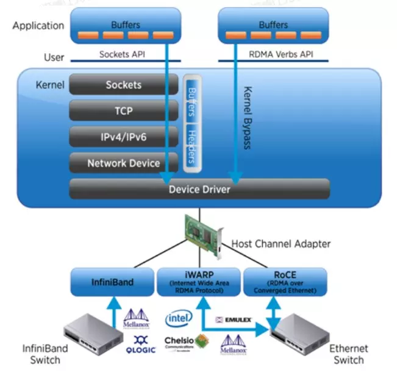

# RDMA

[toc]

## 1. 什么是 RDMA

RDMA 即 Remote Direct Memory Access，其区别于 DMA（Direct Memory Access）。在数据中心领域，RDMA 是一种绕过远程主机操作系统内核访问其内存中数据的技术，由于不经过操作系统，不仅节省了大量 CPU 资源，同样也提高了系统吞吐量、降低了系统的网络通信延迟，尤其适合在大规模并行计算机集群中有广泛应用。在基于 NVMe over Fabric 的数据中心中，RDMA 可以配合高性能的 NVMe SSD 构建高性能、低延迟的存储网络[1]。

RDMA 技术基于 DMA 技术的硬件技术实现，此项技术特点在于在于不需要 CPU 干预而直接访问远程主机内存（应当说成 CPU 不需要负责数据搬运，仅仅需要管理），重点是为解决网络传输中服务器端数据处理的延迟。

## 2. RDMA 的技术

总之，RDMA 技术使得两个远程主机之间避免了：

- CPU 负责的数据搬运，其属于零拷贝技术的一种；
- 数据无需进入内核空间，直接通过网卡传输；

上图清晰地说明了传统通过 Socket 传输的数据，虽然可以实现零拷贝，但是并不能够避免 TCP、IP 层的参与，需要复杂的报头处理逻辑。

但是 RDMA 由于直接通过底层的网络进行数据传输，因此避免了数据在内核空间的报文处理消耗以及数据拷贝消耗。

## REFERENCE

- \[1] [远程直接内存访问](https://zh.wikipedia.org/wiki/%E8%BF%9C%E7%A8%8B%E7%9B%B4%E6%8E%A5%E5%86%85%E5%AD%98%E8%AE%BF%E9%97%AE)
- \[2] [从天猫双11成交额2684亿看RDMA网络](https://www.sdnlab.com/23769.html)

