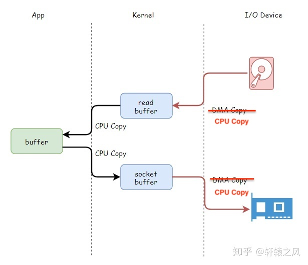
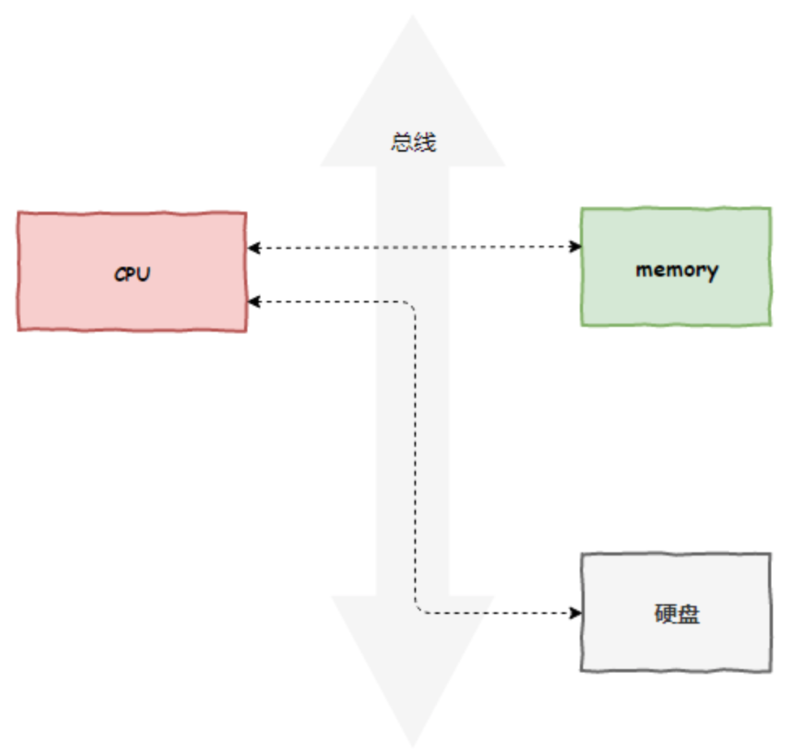
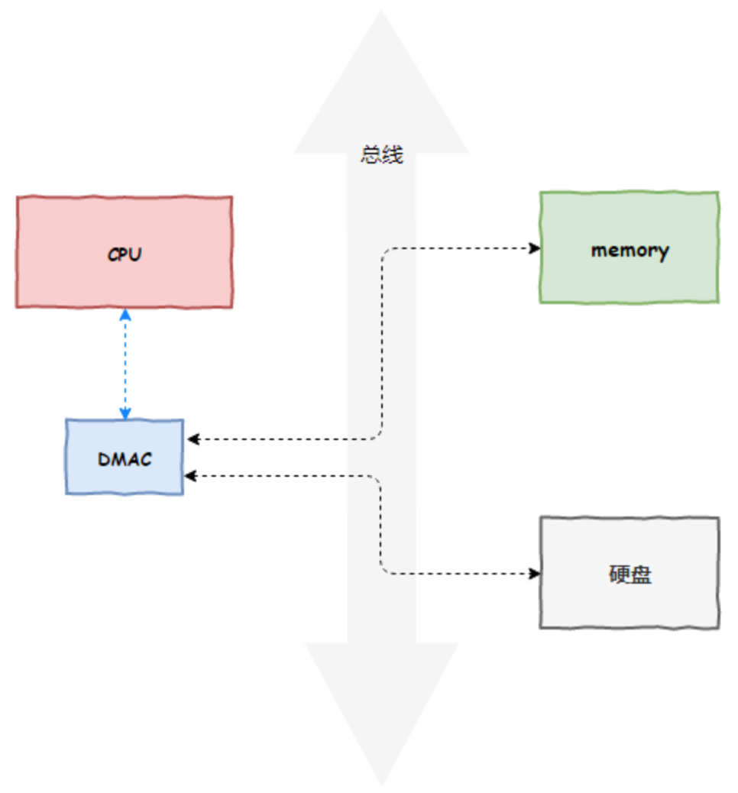
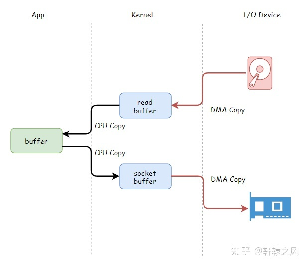
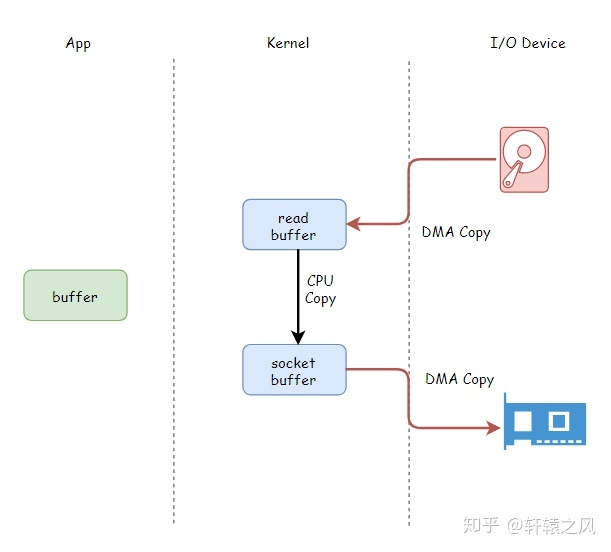

# DMA 技术与 Direct I/O

> **注意事项**：无论是 DMA 技术还是 Direct I/O，与磁盘相关的读写操作都有借助到 page cache 技术。

## 1. 数据的四次拷贝

很多应用程序在面临客户端请求时，可以等价为进行如下的系统调用：

1. File.read(file, buf, len);
2. Socket.send(socket, buf, len);

例如消息中间件 Kafka 就是这个应用场景。

此时，我们会面临数据的四次拷贝，如下图所示：

> 没找到好的图片，因此拿原本讲解 DMA 技术的图进行修改。

因为应用程序是整个数据传输的发起者，包括向磁盘读取数据以及将数据发送至网卡，所以数据总是要经过应用层，这样数据就总共有四次拷贝。

这种全程由 CPU 参与的数据 I/O（拷贝）的方式会导致 CPU 运行效率不高，因为线程会频繁阻塞等待 I/O 完成。因此，计算机工程师们，就发明了 DMA 技术，也就是直接内存访问（Direct Memory Access）技术，来减少 CPU 等待的时间。

## 2. DMA 参与下的数据四次拷贝

DMA 技术很容易理解，本质上，DMA 技术就是我们在主板上放一块独立的芯片。在进行内存和 I/O 设备的数据传输的时候，我们不再通过 CPU 来控制数据传输，而直接通过 DMA 控制器（DMA Controller，简称 DMAC）。这块芯片，我们可以认为它其实就是一个协处理器（Co-Processor）。

DMAC 最有价值的地方体现在，当我们要传输的数据特别大、速度特别快，或者传输的数据特别小、速度特别慢的时候。

比如说，我们用千兆网卡或者硬盘传输大量数据的时候，如果都用 CPU 来搬运的话，肯定忙不过来，所以可以选择 DMAC。而当数据传输很慢的时候，DMAC 可以等数据到齐了，再发送信号，给到 CPU 去处理，而不是让 CPU 在那里忙等待。

注意，这里面的“协”字。DMAC 是在“协助”CPU，完成对应的数据传输工作。在 DMAC 控制数据传输的过程中，我们还是需要 CPU 的进行控制，但是具体数据的拷贝不再由 CPU 来完成。

原本，计算机所有组件之间的数据拷贝（流动）必须经过 CPU，如下图所示：

现在，DMA 代替了 CPU 作为拷贝者，CPU 作为 DMA 的控制者存在，如下图所示：

但是 DMA 有其局限性，在于其用于设备之间交换数据时进行数据拷贝，但是设备内部的数据拷贝还需要 CPU 进行，例如 CPU 内核空间数据与用户空间数据之间的拷贝，如下图所示：

## 3. Direct I/O

Linux 系统使用者发现，在很多应用中，数据需要拷贝到用户态的内存空间中仅仅是因为我们读写操作是应用程序发起的，而不是说应用程序需要这些数据。例如，Kakfa 就是从磁盘上读取一个消息，然后原模原样地发送给消费者（不够严谨，实际上是批量地发送多个数据）。

能不能让数据不要去应用程序那里，直接在内核空间复制一次就好，我们就可以少搬运一次了？

反正最后也是把数据从内核空间交给网卡发，只是免去了数据去用户空间白晃一圈的浪费，如下图所示：

但是，“万一人家要对读取的文件数据进行修改，或者解密，那还是得读到他的用户空间缓存区才行”。

实际上，如果应用确实要用进行数据修改后发送，那么就无法避免内核空间到用户空间的一次数据拷贝。但是，这种情况不多。大部分情况下都是数据原封不动的从内核到用户空间，又从用户空间回到内核。

历史上，确实有一段时间 Linux 就是提供内核口空间的一次拷贝来避免从内核到用户的拷贝，再马上从用户到内核的拷贝。

但在后来，Linux 推出了一个 API，叫 **sendfile**，只需要指定打开文件的描述符和要发送的网络接口描述符，就直接实现了把文件通过网络发出去，如下图所示：

只要把直接把从硬盘读取到的数据缓冲区地址和长度给到网络 socket 描述符，就不用你们再搬运一次数据，彻底解放你们，所以叫零拷贝。

还没完呢！Linux 还把这一技术推广到了文件数据复制上，增加了另一个API:**splice**。

> 备注，I/O 操作通过 `transferTo`和`transferFrom` 完成，但是它们不确保一定使用零拷贝机制。实际上是否能使用零拷贝与操作系统相关，如果操作系统提供`sendfile`这样的零拷贝系统调用，则这两个方法会通过这样的系统调用充分利用零拷贝的优势，否则并不能通过这两个方法本身实现零拷贝。

# REFERENCE

- [CPU：一个故事看懂DMA](https://zhuanlan.zhihu.com/p/272200286)

