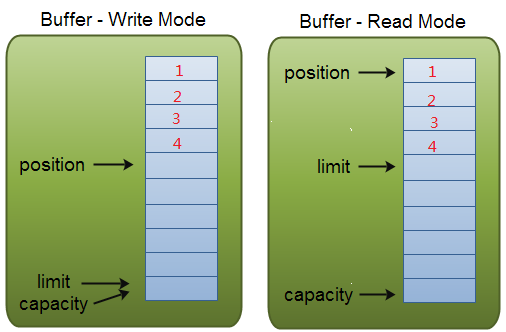
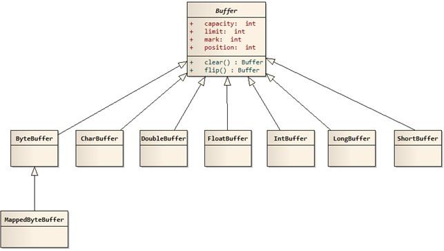
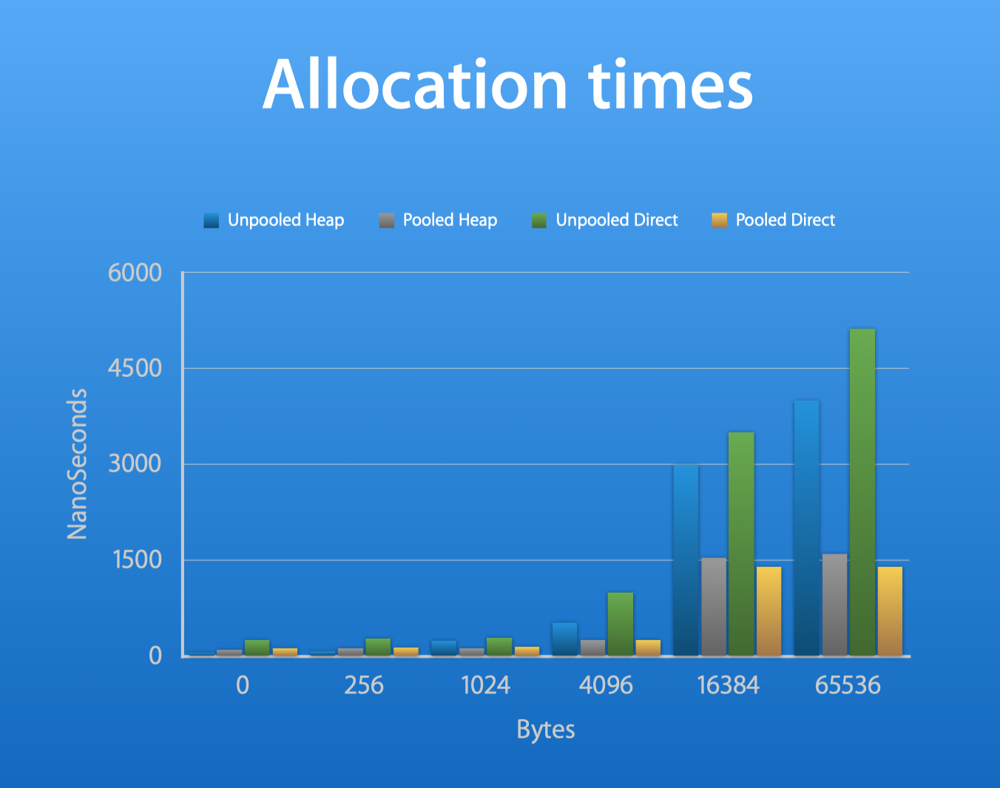
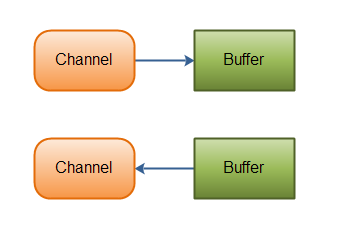

# Java ByteBuffer与 Chanel

## 引言

Java NIO（Socket）由以下几个核心部分组成：

1. Buffer
2. Channel
3. Selector

Selector 重在实现 Socket 的事件驱动模型，是实现 NIO 的关键。而 Buffer 以及 Channel 则提供了一种面向缓冲区的尽力读写功能。

- 传统的 I/O 操作面向数据流，意味着每次从流中读一个或多个字节，直至完成，数据没有被缓存在任何地方。
- NIO 操作面向缓冲区，数据从 Channel 读取到 Buffer 缓冲区，随后在 Buffer 中处理数据。

本节会结合 Netty 框架进行说明，因为其是一个出色的高性能 Java NIO 通信框架。

## 1. Buffer

### 1.1 Buffer 概述

> A buffer is a linear, finite sequence of elements of a specific primitive type.

一块缓存区，内部使用字节数组存储数据，并维护几个特殊变量，实现数据的反复利用。

> 下面虽然会介绍 Buffer 内部字段，但不用过于纠结 Buffer 内部的字段的含义，重要的是了解 Buffer 的特性：
>
> - 同一个 Buffer 既可读又可写；
> - Buffer 的读模式、写模式之间的相互转换需要调用具体方法，读模式式下写会报错，写模式写读也会报错。
> - 当我们需要与 NIO Channel 进行交互时，我们就需要使用到 NIO Buffer，即数据从 Buffer 读取到 Channel 中，或者从 Channel 中写入到 Buffer 中。
> - 实际上，一个 Buffer 其实就是一块内存区域，我们可以在这个内存区域中进行数据的读写。NIO Buffer 其实是这样的内存块的一个封装，并提供了一些操作方法让我们能够方便地进行数据的读写。

1. **mark**：初始值为 - 1，用于备份当前的 position;
2. **position**：初始值为 0，position 表示当前可以写入或读取数据的位置，当写入或读取一个数据后，position 向前移动到下一个位置；因为仅仅支持顺序读写，所以当 Buffer 的读写模式切换时，position 会切换到可读的初始索引处以及可写的初始索引处。
3. **limit**：写模式下，limit 表示最多能往 Buffer 里写多少数据，等于 capacity 值；读模式下，limit 表示最多可以读取多少数据。
4. **capacity**：缓存数组大小。



**mark()**：把当前的 position 赋值给 mark

```java
public final Buffer mark() {
    mark = position;
    return this;
}
```

**reset()**：把 mark 值还原给 position

```java
public final Buffer reset() {
    int m = mark;
    if (m < 0)
        throw new InvalidMarkException();
    position = m;
    return this;
}
```

**clear()**：一旦读完 Buffer 中的数据，需要让 Buffer 准备好再次被写入，clear 会恢复状态值，但不会擦除数据。

```java
public final Buffer clear() {
    position = 0;
    limit = capacity;
    mark = -1;
    return this;
}
```

**flip()**：Buffer 有两种模式，写模式和读模式，flip 后 Buffer 从写模式变成读模式，或者相反。

```java
public final Buffer flip() {
    limit = position;
    position = 0;
    mark = -1;
    return this;
}
```

**rewind()**：重置 position 为 0，从头读写数据。

```java
public final Buffer rewind() {
    position = 0;
    mark = -1;
    return this;
}
```

目前 Buffer 的实现类包括：ByteBuffer、CharBuffer、DoubleBuffer、FloatBuffer、IntBuffer、LongBuffer、ShortBuffer、MappedByteBuffer，继承关系如下图所示：



### 1.2 ByteBuffer 以及 HeapByteBuffer、DirectByteBuffer

> 它们本质上都是字节数组，只是一个在堆内，一个堆外（直接内存）。

ByteBuffer 的实现类包括 "HeapByteBuffer" 和 "DirectByteBuffer" 两种。

我们可以调用 ByteBuffer 类的两个静态方法得到上述两个子类实现：

- **HeapByteBuffer#allocate**

  这个实例的构造实际上最终调用的是 Buffer 类的构造器，也就是说内存空间直接上分配在由 JVM 管理的堆空间中，其内部实际上为一个 byte 数组。

- **DirectByteBuffer#allocateDirect**

  这个实例通过 unsafe#allocateMemory 方法申请堆外内存，并在 ByteBuffer 的 address 变量中维护指向该内存的地址。

可见，这两种 Buffer 的最大区别于数据在内存何处，是位于 JVM 堆内还是堆外，Java 的 NIO 模式同时支持这两种 Buffer。

> 注意：Java 中的 Direct 并不是指操作系统的 Direct I/O，不过他们的作用是类似的。

### 1.3 为什么通常和 NIO 搭配的是 DirectByteBuffer

> 参考网址：[知乎：Java NIO direct buffer 的优势在哪儿？](https://www.zhihu.com/question/60892134)
>
> 其它一些平台可能是在错误地把一些概念整混了。
>
> 这个问题也是个伪命题，因为 NIO 和 HeapByteBuffer 以及 DirectByteBuffer 可以随意搭配，没有任何关系。NIO 对比于 BIO 的性能提升并不在于可以使用 DirectByteBuffer（这仅仅是一个影响非常小的优势）。更大的优势在于凭借单线程就能够处理在 BIO 中多线程才能够处理好的众多网络连接。

- HeapByteBuffer：

  Socket<----> **内核空间的缓存区 <----> 堆外 <---->堆内**。

- DirectByteBuffer：

  Socket <----> **内核空间的缓存区 <----> 堆外**。

> 堆内的数据结构一般称为 Java Heap，而堆外的一般称为 C Heap，它们都处于用户空间。
>
> Socket/文件到内核空间的缓冲区的数据拷贝现在一般由 DMA 机制负责完成，CPU 并不需要参与这个过程。CPU 可能参与的过程是内核空间到堆外（这里的堆外对于非 JVM 应用而言，就是普通用户空间），堆外到堆内。

结论：DirectByteBuffer 相对于 HeapByteBuffer 的优势仅仅在于少了一次堆内与堆外的数据拷贝过程。

**为什么 HeapByteBuffer 也需要使用堆外的内存空间？**

因为 JVM 对内存中的实例实行 GC 管理，GC 可能会导致实例地址的变动，**堆外内存的好处就在于其地址不受 GC 影响**。地址被要求不能够改变的原因是：当我们把一个地址通过 JNI 传递给底层的 C 库的时候，有一个基本的要求，就是这个地址上的内容不能失效。所以无论我们是否使用 DirectByteBuffer，都需要使用一个堆外内存来保存和内核空间交互的数据。

> 如果要把一个 Java 里的 byte[] 对象的引用传给 native 代码，让 native 代码直接访问数组的内容的话，就必须要保证 native 代码在访问的时候这个 byte[] 对象不能被移动，也就是要被“pin”（钉）住。
>
> 可惜 HotSpot VM 出于一些取舍而决定不实现单个对象层面的 object pinning，要 pin 的话就得暂时禁用 GC——也就等于把整个 Java 堆都给 pin 住。
>
> 所以 Oracle/Sun JDK / OpenJDK 的这个地方就用了点绕弯的做法。它假设把 HeapByteBuffer 背后的 byte[] 里的内容拷贝一次是一个时间开销可以接受的操作，同时假设真正的 I/O 可能是一个很慢的操作。

因此，DirectByteBuffer 相对于 HeapByteBuffer 的优势是很有限的：

- 两种方式都有内核空间与用户空间之间的数据拷贝，只是 HeapByteBuffer 额外多一次堆内、堆外数据的拷贝；
- DirectByteBuffer 本身也是一个内存隐患，使用 DirectByteBuffer 并不能像 HeapByteBuffer 或 byte[] 一样任意使用可以被 GC 及时的回收。所以使用 DirectByteBuffer 最好是分配好缓存起来重复使用，否则很容易出现 OOM 错误（内存事实上管理非常复杂）。

**描述 DirectByteBuffer 的精辟总结**：DirectByteBuffer 只是给了用户(Java 程序员)一个操作堆外内存的机会，并不代表 JVM 没有堆外内存的管理（对于 JVM 来说堆外内一直是搓手可得的，因为本来就都在用户空间内，堆外内存并不是随着 JDK 推出 DirectByteBuffer 才可以进行管理的）。

### 1.4 使用 Buffer 的典型案例

这里举一个使用 Buffer 的典型案例。

Buffer 由 `ByteBuffer.allocate(100);` 定义，所以是一个 Java 堆内的 HeapByteBuffer，当然也可以通过 `DirectBuffer.allocateDirect()` 来构造一个 DirectByteBuffer。

一个完成的 NIO 流程是这样的：

- 将 SocketChannel(与本地的一个 Socket 绑定的) 注册到 Selector 中，注册时的兴趣为可读事件。
- 当 `Selector.slect()` 方法返回时，预示着事件发生了，并且此方法停滞阻塞。
- 然后服务器线程去遍历 Socket 队列（epoll/select 遍历的范围有所区别），寻找可读的 Socket；
- 找到之后，服务器利用已经创建好的 （Buffer 一般要求是复用的，不要每个事件就创建一个）Buffer 进行非阻塞读取；
- 然后遍历 Socket 队列的下一个 Socket。
- Socket 队列遍历完毕，继续调用 `Selector.slect()` 方法。

代码如下：

```java
public class SimpleNioServer {
    //这个 map 用于存储分批尽力读取的字节数据
    final static HashMap<SelectionKey, Object> hashMap = new HashMap();


    public static void main(String[] args) {
        Selector selector = null;
        ServerSocketChannel serverSocket = null;
        ByteBuffer buffer = null;
        try {
            //1. 创建 Selector 实例
            selector = Selector.open();
            //2. 创建 ServerSocketChannel 实例
            serverSocket = ServerSocketChannel.open();
            //3. 初始化 ServerSocketChannel 内部的 serverSocket 实例确定绑定的本地端口
            serverSocket.bind(new InetSocketAddress("localhost", 2333));
            //4. 将 ServerSocketChannel 配置成非阻塞模式，这是必要的，
            // 因为 ServerSocketChannel 和由其生产出来的 SocketChannel 实例都在 while 循环中被检查是否触发了事件，
            // 否则，没有新的请求导致 SocketChannel.accept() 阻塞，会影响 selector 去判别 SocketChannel 是否可读。
            serverSocket.configureBlocking(false);
            //5. 将 ServerSocketChannel 注册到 Selector 中，事件是 OP_ACCEPT，一旦有 TCP 连接请求就会触发
            serverSocket.register(selector, SelectionKey.OP_ACCEPT);
            // 测试性地尝试注册两次
            serverSocket.register(selector, SelectionKey.OP_ACCEPT);
            //6. 创建 Buffer 用于从 SocketChannel 中读取字节数据
            buffer = ByteBuffer.allocate(100);
        } catch (IOException e) {
            e.printStackTrace();
        }

        while (true) {
            // 7. 如果迭代器内部有事件发生，那么不阻塞，否则阻塞
            try {
                selector.select();
            } catch (IOException e) {
                e.printStackTrace();
            }
            // 8. 阻塞结束，说明 selector 中有事件触发，所以获得其迭代器进行处理
            Set<SelectionKey> selectedKeys = selector.selectedKeys();
            Iterator<SelectionKey> iter = selectedKeys.iterator();
            //9. 迭代器中全体元素的循环
            while (iter.hasNext()) {

                SelectionKey key = iter.next();
                //10. 因为仅仅对 ServerSocketChannel 单例进行了 OP_ACCEPT 事件注册，所以断定地知道来了一个建立 TCP 连接请求。
                //调用此 register 方法得到 ServerSocketChannel 中的一个 SocketChannel 并注册到 Selector 中，事件为 OP_READ
                if (key.isAcceptable()) {
                    try {
                        //这里的含义是将 ServerSocketChannel 实例 serverSocket 注册到 selector 内部
                        register(selector, serverSocket);
                    } catch (IOException e) {
                        e.printStackTrace();
                    }
                }
                //11. 我们为所有的 SocketChannel 注册了 OP_READ 事件，所以此事件发生时意味着可读了,于是调用 answerWithEcho 方法进行读
                if (key.isReadable()) {
                    try {
                        read(buffer, key);
                    } catch (IOException e) {
                        e.printStackTrace();
                    }
                }
                //12. 将此 SelectableChannel 移出迭代器是必要的，否则会进行没有必要的事件是否准备好的询问
                iter.remove();
            }
        }
    }

    private static void read(ByteBuffer buffer, SelectionKey key)
            throws IOException {
        System.out.println("read 方法被调用了");
        //1. 得到 SelectionKey 实例内部的 SocketChannel 实例，因为可读状态下需要利用 Channel 进行读取字节数据
        SocketChannel socketChannel = (SocketChannel) key.channel();
        //2. 构造一组键值对，key 为 SelectionKey 实例，value 为 List，用于存储多次尽力读取的字节数组
        if (!hashMap.containsKey(key))
            hashMap.put(key, new ArrayList<>());
        //3. 此标志用于判断：
        //0： UNIX 底层的缓冲字节数组被读完了或者 ByteBuffer 没有写一个字节，这里指的是前者，因为每次读取后都 clear 了；
        //-1: 意味这 EOF，即 HTTP 请求数据已经全部传输到服务端 Socket 了。
        //其他大于 0 的数字：意味着这里从底层 UNIX 缓冲字节数组读取了几个字节
        int count = 0;
        while (buffer.hasRemaining() && (count = socketChannel.read(buffer)) > 0) {

            //使 Buffer 变成可读
            buffer.flip();
            ArrayList list = (ArrayList) hashMap.get(key);

            byte[] arr = new byte[buffer.remaining()];
            buffer.get(arr);
            buffer.rewind();
            list.add(arr);
            buffer.clear();
        }
        //当 socketChannel.read(buffer) 返回 -1 时，意味着此时彼通道数据传输已经完成，因为遇到了流传输中的 EOF 标志
        // 如果没有读到字节流末尾，那么选择不关闭，因为下一次还是要继续读取
        if (count == -1) {
            //这些代码用于验证一次次的 Buffer 工作是否正确地转换为 byte 数组保存起来。
            ArrayList list = (ArrayList) hashMap.get(key);

            final Iterator iterator = list.iterator();

            while (iterator.hasNext()) {
                final byte[] next = (byte[]) iterator.next();
                System.out.println(next.length);
            }

            socketChannel.close();
        }

    }

    private static void register(Selector selector, ServerSocketChannel serverSocket)
            throws IOException {
        //1. 利用 ServerSocketChannel accept 方法能够得到一个此次连接请求对应的 SocketChannel 实例
        SocketChannel client = serverSocket.accept();
        //2. 将此 SocketChannel 实例设置为非阻塞模式
        client.configureBlocking(false);
        //3. 将此 SocketChannel 注册到 Selector 中，事件为 OP_READ，即可读事件，此方法返回的 SelectionKey 并不需要保存并引用起来
        client.register(selector, SelectionKey.OP_READ);
    }

}
```

### 1.5 Benchmark of DirectBuffer

正如前文所述，DirectByteBuffer 与 HeapDirectBuffer 的性能差距不大，实际上应用层的 Buffer 缓存管理分配机制（内存池化）才是影响性能的最重要原因。当然，上述说法需要在具体应用场景下的 benchmark 来证明。

使用 HeapByteBuffer 的应用可以选择全权把内存管理交给 GC 线程，虽然使用应用层的 Buffer 缓存管理分配机制能得到更好的性能。

但是使用 DirectByteBuffer 的应用必须使用基于应用层的 Buffer 缓存管理分配机制，这是因为 DirectByteBuffer 在 GC 上存在问题：通常申请再多的 DirectByteBuffer 实例也难以触发 full GC，但是只有触发 full GC，GC 线程才会负责去触发 DirectByteBuffer 实例的回收。因此，使用 DirectByteBuffer 的应用通常需要在应用层实现一个 Buffer 缓存管理分配机制。

Netty 为 DirectByteBuffer 与 HeapDirectBuffer 都实现了 Buffer 缓存管理分配机制（内存池化）。

总之，事实上，使用 DirectByteBuffer 虽然可以提升性能，但实际上是出于不提升白不提升的目的，提升性能远远没有想象中那么大，因为其仅仅节约了堆外、堆内的数据复制操作，而这部分工作由 CPU 来完成是非常快的。

下图是 Twitter 对 Netty 的测试结果：



> 数值越大代表时间越长，性能越差。

- Polled Heap 和 Polled Direct 相比几乎没有太大的区别；
- Unpolled Heap 和 unpolled Direct 相比区别略为大了一点，但是不够显著。

由图可知，DirectByteBuffer 相较于 HeapByteBuffer 可以提升一定性能，但是远远没有达到 Poll 相比于 Unpoll 的提升。

### 1.6 堆外内存的回收

这里先回顾一下 JVM 堆内的内存回收的相关概念（粗略）：

- **新生代**：一般来说新创建的对象都分配在这里。
- **年老代**：经多次垃圾回收仍存活，新生代的对象就会放在年老代中。年老代中的对象保存的 GC 轮次更多。
- **永久代**：这里面存放的是 class 相关的信息，一般是不会进行垃圾回收的。

**JVM 的垃圾回收策略**：

- **Minor GC**: 当新创建对象，内存空间不够的时候，就会执行这个垃圾回收。由于执行最频繁，因此一般采用标记复制机制。
- **Major GC**: 清理年老代的内存，这里一般采用的是标记整理机制。
- **Full GC**: 有的说与 Major GC 差不多，有的说相当于执行 minor+major 回收，但在这里我们暂且可以认为 Full GC 就是全面的垃圾回收吧。

需要我们回收内存的原因有 3 个：

1. 内存空间有限：如果应用程序不断申请内存空间但是不回收，那么内存很快就会分配完毕，最终导致内存异常异常，包括：
   1. java.lang.OutOfMemoryError: Direct buffer memory
   2. java.lang.OutOfMemoryError: Requested array size exceeds VM limit
2. 内存池化技术性能高：内存池化技术能够实现内存复用，因为反复的内存的申请以及分配代价高昂，池化技术能够提高整体系统性能；
3. 堆外内存需要应用层自己实现一套内存回收机制，GC 对堆外内存的回收能力非常有限；

**1.DirectByteBuffer 的内存回收**

由前面的文章可知，堆外内存分配很简单，直接调用 ByteBuffer#allocateDirect 方法即可。

在 C 语言的内存分配和释放函数 malloc/free，必须要一一对应，否则就会出现内存泄露或者是野指针的非法访问。但是 JVM 拥有 GC 机制，通常并不需要应用层负责实例的内存释放。

DirectByteBuffer 的的内存回收非常受限，因为其所占内存只有发生 full GC 的情况下才会被回收（而且不是 GC 线程负责回收）。而 full GC 的触发是无法通过 Java 代码控制的，例如 System#gc 方法的语义无法确保 JVM 马上执行 GC 线程，它只是建议 JVM 进行垃圾回收。因此，很容易发送堆外内存溢出的问题。

DirectByteBuffer 的另一个缺陷是即使 GC 线程能够确保不发生堆外内存溢出，但是反复的堆外内存回收、分配会导致不尽人意的性能。

因此就像 Netty 一样，需要实现一套应用层 DirectByteBuffer 的池化技术，既负责内存回收，也负责内存缓存与分配。

> 补充说明：
>
> Netty 的堆外内存分配是直接基于 Unsafe 进行，而不是基于 DirectByteBuffer#allocate 方法。所以 GC 线程完全不会管理 Netty 框架中堆外内存的分配，后者全权由 Netty 应用层逻辑负责回收。

**2.源码分析**

先来看一个 jdk nio 的 DirectByteBuffer 类的 package-private 构造器，如下：

```java
DirectByteBuffer(int cap) {
    super(-1, 0, cap, cap);
    //是否页对齐
    boolean pa = VM.isDirectMemoryPageAligned();
    //页的大小4K
    int ps = Bits.pageSize();
    //最小申请1K，若需要页对齐，那么多申请1页，以应对初始地址的页对齐问题
    long size = Math.max(1L, (long)cap + (pa ? ps : 0));
    //检查堆外内存是否够用, 并对分配的直接内存做一个记录
    Bits.reserveMemory(size, cap);
    long base = 0;
    try {
        //直接内存的初始地址, 返回初始地址
        base = unsafe.allocateMemory(size);
    } catch (OutOfMemoryError x) {
        Bits.unreserveMemory(size, cap);
        throw x;
    }
    //对直接内存初始化
    unsafe.setMemory(base, size, (byte) 0);
    //若需要页对齐，并且不是页的整数倍，在需要将页对齐（默认是不需要进行页对齐的）
    if (pa && (base % ps != 0)) {
        // Round up to page boundary //初始地址取整页，注意申请的地址为取整数页
        address = base + ps - (base & (ps - 1));
    } else {
        address = base;
    }
    //声明一个Cleaner对象用于清理该DirectBuffer内存
    cleaner = Cleaner.create(this, new Deallocator(base, size, cap));
    att = null;
}
```

可以看到，DirectByteBuffer 通过直接调用 base=unsafe.allocateMemory (size) 操作堆外内存，返回的是该堆外内存的直接地址，存放在 address 中，以便通过 address 进行堆外数据的读取与写入。

我们需要了解下，`Bits.reserveMemory()` 如何判断堆外内存是否可用的：

```java
static void reserveMemory(long size, int cap) {  //对分配的直接内存做一个记录
       synchronized (Bits.class) {
           if (!memoryLimitSet && VM.isBooted())
           {
               //堆外直接内存默认等于堆内内存大小, 可以通过
               maxMemory = VM.maxDirectMemory();
               memoryLimitSet = true;
           }
           // -XX:MaxDirectMemorySize limits the total capacity rather than the
           // actual memory usage, which will differ when buffers are page
           // aligned.
           //如果够分的话，则直接退出
           if (cap <= maxMemory - totalCapacity) {
               reservedMemory += size;
               totalCapacity += cap; //
               count++;
               return;
           }
       }
       //不够分的话，则调用System.gc()进行一次full gc. 一般不要在线程启动时添加-XX:+DisableExplicitGC（禁止代码显示调用gc）
       System.gc(); //只是告知机器，这里应该GC一次， 但是实际并不一定进行垃圾回收
       try {
            //再等待100ms使gc有时间完成，然后再看是否够分配
           Thread.sleep(100);
       } catch (InterruptedException x) {
           // Restore interrupt status
           Thread.currentThread().interrupt();
       }
       synchronized (Bits.class) {
           //此时不够分的话，再调用向外抛出oom
           if (totalCapacity + cap > maxMemory)
               throw new OutOfMemoryError("Direct buffer memory");
           reservedMemory += size;
           totalCapacity += cap;
           count++;
       }
   }
```

- 首先检查堆外内存是否够分
- 若不够分的话，再进行一次 full gc 显式推动对堆外内存的回收，再次尝试分配堆外内存，不够分的话，则抛出 OOM 异常。

**堆外内存的回收-JDK-nio 的 DirectByteBuffer**

在 DirectByteBuffer 的构造函数中，我们可以看到这样的一行代码 `cleaner = Cleaner.create(this, new Deallocator(base, size, cap));`, 没错，**直接内存释放主要由 cleaner 来完成**。我们知道 **JVM GC 并不能直接释放直接内存，但是 GC 可以释放管理直接内存的 DirectByteBuffer 对象**。我们需要注意下 cleaner 的类型:

```java
public class Cleaner  extends PhantomReference<Object>
```

PhantomReference 并不会对对象的垃圾回收产生任何影响，当进行 gc 完成后，当发现某个对象只剩下虚引用后，会将该引用迁移至 Reference 类的 pending 队列进行回收。这里可以看到 DirectByteBuffer 被 Cleaner 引用着。Reference 操作回收代码如下:

```java
static private class Lock { };
private static Lock lock = new Lock();
/* List of References waiting to be enqueued.  The collector adds
 * References to this list, while the Reference-handler thread removes
 * them.  This list is protected by the above lock object. The
 * list uses the discovered field to link its elements.
 */
//当gc时，发现DirectByteBuffer除了PhantomReference对象引用,没有其他对象引用， 会把DirectByteBuffer放入其中，等待被回收
private static Reference<Object> pending = null;
/* High-priority thread to enqueue pending References
 */
private static class ReferenceHandler extends Thread {
    ReferenceHandler(ThreadGroup g, String name) {
        super(g, name);
    }
    public void run() {
        for (;;) {
            Reference<Object> r;
            synchronized (lock) {
                if (pending != null) {
                    r = pending;
                    pending = r.discovered;
                    r.discovered = null;
                } else {
                    // The waiting on the lock may cause an OOME because it may try to allocate
                    // exception objects, so also catch OOME here to avoid silent exit of the
                    // reference handler thread.
                    //
                    // Explicitly define the order of the two exceptions we catch here
                    // when waiting for the lock.
                    //
                    // We do not want to try to potentially load the InterruptedException class
                    // (which would be done if this was its first use, and InterruptedException
                    // were checked first) in this situation.
                    //
                    // This may lead to the VM not ever trying to load the InterruptedException
                    // class again.
                    try {
                        try {
                            //如果没有的话，会一直等待唤醒
                            lock.wait();
                        } catch (OutOfMemoryError x) { }
                    } catch (InterruptedException x) { }
                    continue;
                }
            }
            // Fast path for cleaners
            if (r instanceof Cleaner) {
                 //从头开始进行clena()调用
                ((Cleaner)r).clean();
                continue;
            }
            ReferenceQueue<Object> q = r.queue;
            if (q != ReferenceQueue.NULL) q.enqueue(r);
        }
    }
}
static {
    ThreadGroup tg = Thread.currentThread().getThreadGroup();
    for (ThreadGroup tgn = tg;
         tgn != null;
         tg = tgn, tgn = tg.getParent());
    Thread handler = new ReferenceHandler(tg, "Reference Handler");
    /* If there were a special system-only priority greater than
     * MAX_PRIORITY, it would be used here
     */
    handler.setPriority(Thread.MAX_PRIORITY);
    handler.setDaemon(true);
    handler.start();
}
```

可以看出来，JVM 会新建名为 `Reference Handler` 的线程，时刻回收被挂到 pending 上面的虚拟引用 (该线程在 JVM 启动时就会产生)。 当 DirectByteBuff 对象仅被 Cleaner 引用时，Cleaner 被放入 pending 队列，之后调用 `Cleaner.clean()` 方法：

```java
public void clean() {  //这里的clean(）会在Reference回收时显示调用
        if (!remove(this))
            return;
        try {
            thunk.run();
        } catch (final Throwable x) {
            AccessController.doPrivileged(new PrivilegedAction<Void>() {
                    public Void run() {
                        if (System.err != null)
                            new Error("Cleaner terminated abnormally", x)
                                .printStackTrace();
                        System.exit(1);
                        return null;
                    }});
        }
}
//就是一个释放直接内存的线程
private static class Deallocator  implements Runnable
{
        private static Unsafe unsafe = Unsafe.getUnsafe();
        private long address;
        private long size;
        private int capacity;
        private Deallocator(long address, long size, int capacity) {
            assert (address != 0);
            this.address = address;
            this.size = size;
            this.capacity = capacity;
        }
        public void run() {
            if (address == 0) {
                // Paranoia
                return;
            }
            unsafe.freeMemory(address); //释放地址
            address = 0;
            Bits.unreserveMemory(size, capacity); //修改统计
        }
}
```

也就是说最终是通过调用 `Unsafe.freeMemory()` 方法来释放直接内存的。

所以如果简化 JDK nio 中 DirectByteBuffer 的创建与回收，那么步骤为：

- 利用静态方法 `DirectByteBuffer.allocateDirect()` 进行堆外内存的分配，本质上是利用 `unsafe.allocateMemory(size);` 来申请堆外内存。

- DirectByteBuffer 的构造过程中，在最后将自己作为引用传入 Cleaner 实例中。

- 当 GC 完成后，当发现某个对象只剩下虚引用后，会将该 Cleaner 实例迁移至 Reference 类的 pending 队列进行回收。

  > GC 本身不负责 DirectByteBuffer 的回收，其只是负责将将 DirectByteBuffer 的引用迁移至 Reference 类的 pending 队列进行回收。
  >
  > 这个队列始终在进行回收工作。

- 在 pending 队列中，会负责回调 cleaner 实例的 clean() 方法，clean() 方法中会调用 Deallocator 实例的 run() 方法，在这个方法中会负责将 cleaner 对应的堆外内存释放。

  ```java
  unsafe.freeMemory(address);
  ```

DirectByteBuffer 就是如此依靠着 JVM 的 GC 进行内存回收的。实际上，通过下面两个组合就能够实现堆外内存的分配和回收：

- `unsafe.allocateMemory(size);`
- `unsafe.freeMemory(address);`

因为 Netty 的堆外内存管理自己使用了一套机制：jemalloc，目的就是在应用层实现一套自己的内存管理（内存分配和内存回收），而不依赖 JVM 的 GC 机制。

本质上，Netty 的内存管理也是依赖于 Unsafe 的两个方法，见上。Netty 选择自己实现另一套（完全没有继承、包含关系）的 ByteBuf，最终的目的就是为了使用自己的应用层内存分配管理机制。

### 1.7 ByteBuffer 的 JVM 配置

堆内、堆外的内存空间都是有限的，当内存申请超过启动时的最大内存配置就会报错：

- HeapByteBuffer 的内存限制主要受到 JVM 内存配置的影响，`-Xms` 参数用于控制初始堆大小，`-Xmx` 参数用于控制最大堆大小。由于堆内还需要存放其他实例，因此实际上 HeapByteBuffer 能够申请的内存大小小于 `-Xms` 配置；
- DirectByteBuffer 的内存限制受到 `-XX:MaxDirectMemorySize` 参数的影响；

当然，上述内存配置都无法超过物理机的虚拟内存大小。

另一方面，单个 HeapByteBuffer 与 DirectByteBuffer 的最大数据量都为 Integer.MAXVALUE 个 byte，也就是 2000 MB 左右的内存大小。如果要申请 4GB 的内存，那么至少需要两个 ByteBuffer 实例。

## 2. Channel

> A channel represents an open connection to an entity such as a hardware device, a file, a network socket, or a program component that is capable of performing one or more distinct I/O operations, for example reading or writing.

Channel 类位于 java.nio.channels 包中，但并不是 Channel 仅仅支持 NIO，其分为两种类型：

- FileChannel：完全不支持 NIO；
- SocketChannel/ServerSocketChannel 等 Channel 默认情况下并不支持 NIO，只有显式地调用配置方法才能够进入非阻塞模式（`ServerSocketChannel.configBlocking(false)`）。

下面主要以 SocketChannel 的角度来介绍 Channel 类。

Channel 我们可以理解为对应于 BIO 中的 Socket，也可以理解为 Scoket.inputStream/SocketOutputStream。如果认为是流，那么我们做一个比较：

- 传统 Socket：我们调用 Socket 的 `getInputStream()` 以及 `getOutputStream()` 进行数据的读和写。
- Channel：我们不再需要得到输入输出流进行读和写，而是通过 Channel 的 `read()` 以及 `write()` 方法进行读和写。

Channel 如此实现也付出了代价（如下图所示）：

- 读写模式需要调用 `flip()` 方法进行切换，读模式下调用 `write()` 试图进行写操作会报错。
- 读写不再能够接受一个简单的字节数组，而是必须是封装了字节数组的 Buffer 类型。



目前已知 Channel 的实现类有：

- FileChannel

  > 一个用来写、读、映射和操作文件的通道。

- DatagramChannel

- SocketChannel

  SocketChannel 可以看做是具有非阻塞模式的 Socket。其可以运行在阻塞模式，也可以运行在非阻塞模式。其只能依靠 ByteBuffer 进行读写，而且是尽力读写，尽力的含义是：

  - ByteBuffer 满了就不能在读了；
  - 即使此次 Socket 流没有传输完毕，但是一旦 Channel 中的数据读完了，那么就返回了，这就是非阻塞读。所以读的方法有 -1（EOF），0（Channel 中的数据读完了，但是整个数据流本身没有消耗完），其他整数，此次读的数据（因为 ByteBuffer 并不是每次都是空的，原来就有数据时只能够尽力装满）。

- ServerSocketChannel

  这个类似于 ServerSocket 起到的作用。

## 3. 为什么 Netty 要封装原有的 Buffer 以及 Channel

- 原生的 Buffer + Channel 的读写方式容易导致错误，比如写和读共用一个 index，经常容易犯的错误是写完在读的时候忘记 `flip()`。Netty 的有 readerindex 和 writerindex，用起来更方便了。
- 提供更高层次的封装，提供更为丰富的功能。比如 Netty 的 Buffer 可以让我们方便的将两个小 Buffer 合并为一个大 Buffer 而不需要进行 byte 的复制。
- Netty 提供了更好的内存管理：**JDK 的 DirectBytebuffer 虽然也使用堆外内存，但是依赖 JVM 进行 GC**。但是 Netty 自己实现了 ByteBuf 的内存管理 jemalloc，性能更好，且完全不受到 GC 的管理。

## REFERENCE

- [知乎：Java NIO direct buffer 的优势在哪儿？](https://www.zhihu.com/question/60892134)
- [Java NIO中，关于DirectBuffer，HeapBuffer的疑问？](https://www.zhihu.com/question/57374068/answer/152691891)
- [Java堆外内存之三：堆外内存回收方法](https://www.cnblogs.com/duanxz/p/6089485.html)
- [Netty - One Framework to rule them all](http://www.datascienceassn.org/sites/default/files/Netty%20-%20Asynchronous%20Network%20Application%20Framework.pdf)


