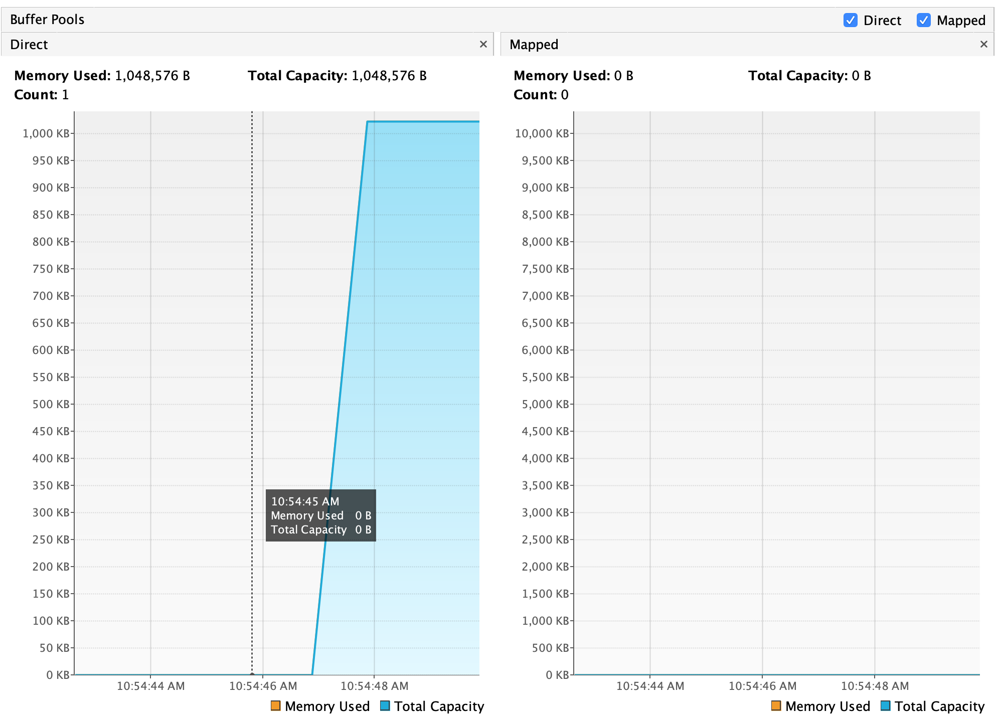
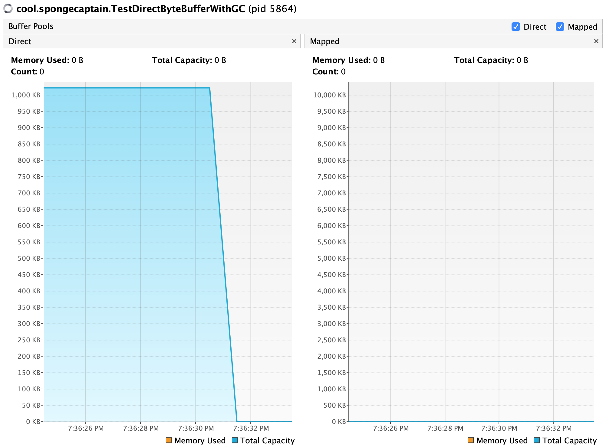
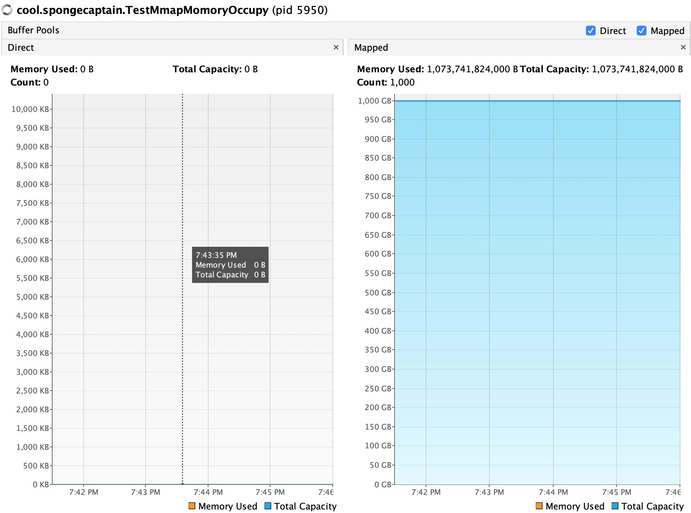
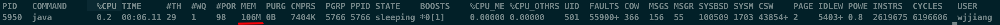

# Java ByteBuffer 测试

## 1. Java-HeapByteBuffer 的读/写操作时会自动构造一个 DirectByteBuffer 实例

JVM 的 HeapByteBuffer 在进行读写操作时，JVM 会在堆外自动构造一个 DirectByteBuffer 实例（这里的意思是需要在堆外在开辟一个一样大小的内存区域），过程如下图所示：

HeapByteBuffer(created by user) <-automatically-> DirectByteBuffer(created by JVM) <-system call-> pagecache <-DMA-> File on Disk

**1.JVM 为何如此设计？**

这么设计的理由可以参考：https://www.zhihu.com/question/57374068/answer/152691891

**2.测试向**

为了测试 HeapByteBuffer 的这个性质，我们可以利用 Visual VM 工具来测试，我们需额外安装 VisualVM-BufferMonitor 插件。

测试代码如下：

```java
package cool.spongecaptain;

import java.io.IOException;
import java.nio.ByteBuffer;
import java.nio.channels.FileChannel;
import java.nio.file.FileSystems;
import java.nio.file.Path;
import java.nio.file.StandardOpenOption;
import java.util.concurrent.CountDownLatch;

public class TestHeapByteBufferWithWrite {
    public static void main(String[] args) throws InterruptedException, IOException {
        //allocate 1MB size HeapByteBuffer
        ByteBuffer heapByteBuffer = ByteBuffer.allocate(1024 * 1024);
        //make sure you have this file in the path
        Path path = FileSystems.getDefault().getPath("/Users/wjjiang/Desktop/temp.md");
        FileChannel fileChannel = FileChannel.open(path, StandardOpenOption.READ,StandardOpenOption.WRITE);
        //block on purpose
        System.in.read();
        fileChannel.write(heapByteBuffer);
        //block on purpose
        new CountDownLatch(1).await();
    }
}
```

我们可以在 VisualVM-BufferMonitor 插件对应的页面中看到如下结果：



测试结果证明了这个说法。

## 2. DirectByteBuffer 会受到 GC 作用吗？

虽然有“堆外内存的好处就在于不受 GC 影响”的说法，但在事实上，GC 能够回收堆外内存。

**1.GC 如何管理堆外内存？**

当 JVM 发生 full GC 时，会找到指向堆外内存的 DirectByteBuffer 实例，然后进行回收。但是 GC 并不会自己去负责回收 DirectByteBuffer 实例，而是依赖于 DirectByteBuffer 的静态内部类 Deallocator，后者实现了一个 Runnable 接口，后者的执行逻辑是创建一个线程释放该 DirectByteBuffer 对象 malloc 申请的直接内存空间。

正是因为如此，虽然 GC 算法（除了 CMS 算法）之外在 GC 发生时都需要移动 DirectBuffer 对象，但由于回收 DirectByteBuffer 对象所指向的内存空间不是由 GC 线程完成的，所以保证了堆外内存地址的不变性。

注意区分堆内 DirectByteBuffer 与堆外 DirectByteBuffer 实例指向的内存地址空间：

- DirectByteBuffer 实例是由 GC 线程回收的，其地址会随着 GC 改变；
- DirectByteBuffer 实例指向的堆外地址由 Deallocator 线程回收，其地址不会随着回收改变。

在堆内的 DirectByteBuffer 实例指向堆外一个较大的内存区域，这种对象被称为冰山对象。

总之，堆外内存不是直接由 GC 线程负责回收，因此减少了 GC 线程的压力，但同时也受到了 GC 线程管理。

**2.测试**

为了证明堆外内存也受到 GC 的管理，写了如下的测试案例：

```java
package cool.spongecaptain;

import java.io.IOException;
import java.nio.ByteBuffer;
import java.util.concurrent.CountDownLatch;

public class TestDirectByteBufferWithGC {
    public static void main(String[] args) throws InterruptedException, IOException {
        //allocate 1MB size DirectByteBuffer
        ByteBuffer directBytebuffer = ByteBuffer.allocateDirect(1024 * 1024);

        System.in.read();
        //help the GC to free
        directBytebuffer = null;

        System.gc();

        //block on purpose
        new CountDownLatch(1).await();
    }
}
```

测试结果：



## 3. DirectByteBuffer 的主动内存释放

**1.DirectByteBuffer 不应依赖于 JVM 的 GC 进行回收**

正如第二节所说，只有 JVM 进行 full GC 时，GC 线程才会触发 DirectByteBuffer 的“标记”，然后利用非 GC 线程去回收堆外内存。但在另一方面，DirectByteBuffer 实例在堆内所占内存空间非常小，因此 DirectByteBuffer 实例本身的构造难以导致 full GC。堆外内存使用再多，也无法触发 full GC。

如果 DirectByteBuffer 完全依赖于 JVM 的 GC 机制进行内存回收管理，那么很容易导致堆外内存分配过多，最终导致 `OutOfMemoryError("Direct buffer memory”)` 异常。

**2.JVM 之上的 DirectByteBuffer 主动释放**

DirectByteBuffer 的释放可以由用户代码主动触发。方法是利用 Cleaner#clean 方法。

**3.测试**

```java
package cool.spongecaptain;

import sun.nio.ch.DirectBuffer;

import java.io.IOException;
import java.nio.ByteBuffer;
import java.util.concurrent.CountDownLatch;

public class TestDirectBufferCleaner {
    public static void main(String[] args) throws IOException, InterruptedException {
        //allocate 1MB size DirectByteBuffer
        ByteBuffer directBytebuffer = ByteBuffer.allocateDirect(1024 * 1024);
        //block on purpose
        System.in.read();
        //help the GC to free
        ((DirectBuffer)directBytebuffer).cleaner().clean();
        //block on purpose
        new CountDownLatch(1).await();
    }
}
```

通过 VisualVM 工具观察结果如下：


## 4. MMAP 的内存大小可以远大于内存？

我们通过 FileChannel#map 方法能够在 Java 中实现 MMAP 机制，我们可以发现，mmap 能够“申请”到远大于物理机内存大小的内存。

测试代码如下：

```java
package cool.spongecaptain;

import java.io.IOException;
import java.nio.ByteBuffer;
import java.nio.channels.FileChannel;
import java.nio.file.FileSystems;
import java.nio.file.Path;
import java.nio.file.StandardOpenOption;
import java.util.concurrent.CountDownLatch;

public class TestMmapMomoryOccupy {
    public static void main(String[] args) throws IOException, InterruptedException {
        //allocate 1MB size HeapByteBuffer
        ByteBuffer heapByteBuffer = ByteBuffer.allocate(1024 * 1024);
        //make sure you have this file in the path
        Path path = FileSystems.getDefault().getPath("/Users/wjjiang/Desktop/temp.md");
        FileChannel fileChannel = FileChannel.open(path, StandardOpenOption.READ,StandardOpenOption.WRITE);
        //allocate 1000G size memory
        for (int i = 0; i < 1000; i++) {
            fileChannel.map(FileChannel.MapMode.READ_WRITE, 0, 1024L * 1024 * 1024);
        }
        //block on purpose
        new CountDownLatch(1).await();
    }
}
```

上述代码通过“申请”，映射得到了 1000G 大小的内存，但是我本机只有 16G 大小的内存，如何能够得到如此大的内存空间呢？

VisualVM 的监控结果如下图所示：



我们向操作系统询问一下该线程（pid 为 5950）一共占据了多大的内存空间，命令为 `top -pid 5950`。



可见，此 Java 线程仅仅占用了 106MB 大小的内存，远远不及 1000GB 大小。而且事实上，我的机器只有 16GB 的内存大小。

从测试结果中反映出如下两个事实：

1. 内存映射并不等于内存占用，很多文章认为内存映射这种方式可以大幅度提升文件的读写速度，并宣称“写 MappedByteBuffer 就等于写内存”，实际是非常错误的认知。通过控制面板可以查看到该 Java 进程（pid 5950）实际占用的内存仅仅不到 100M。很多写操作会会触发页缺失异常，然后需要进行磁盘 I/O。
2. MappedByteBuffer 映射出一片文件内容之后，不会全部加载到内存中，而是会进行一部分的预读（体现在占用的那 100M 上），MappedByteBuffer 不是文件读写的银弹，它仍然依赖于 PageCache 异步刷盘的机制。 **通过 Java VisualVM 可以监控到 mmap 总映射的大小，但并不是实际占用的物理内存大小**。

## REFERENCE

- [一文探讨堆外内存的监控与回收](https://www.cnkirito.moe/nio-buffer-recycle/)
- [Java NIO中，关于DirectBuffer，HeapBuffer的疑问？](https://www.zhihu.com/question/57374068/answer/152691891)