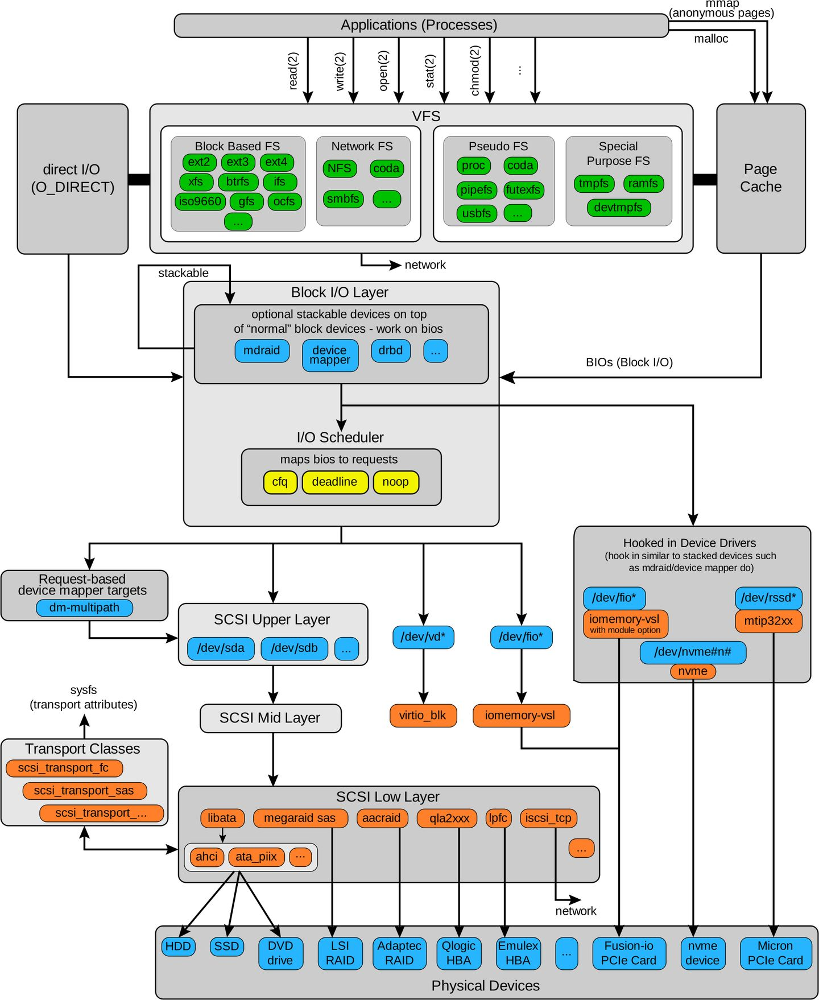

# 文件 I/O 简明概述

文件 I/O 性能是后台应用的主要瓶颈之一，一直以来想对文件 I/O 这个偌大的系统进行总结，故写此文。

文件 I/O 内容较多，为了避免在个人博客上一次性发表太多文章，而书籍更具备条理与机构结构性，另一个原因是部分内容原创性不高，因此以 Git Pages 的形式发布。

本 Git Pages 主要面向 Java 语言开发者，不过各个章节之间联系不大，非 Java 开发者可以选择跳过相关章节，并不影响阅读。

相关引用在 REFERENCE 小节中指出。

内容包括：

- [1.page cache](1. page cache.html)
- [2.DMA 与零拷贝技术](2. DMA 与零拷贝技术.html)
- [3.mmap](3. mmap.html)
- [4.文件分区](4. 文件分区.html)
- [5.Java ByteBuffer与 Channel](5. Java ByteBuffer与 Channel.html)
- [6.FileChannel](6. FileChannel.html)
- [7.JavaVisual 工具](7. JavaVisual 工具.html)
- [8.Java ByteBuffer 测试](8. Java ByteBuffer 测试.html)
- [9.如何实现顺序读写](9. 如何实现顺序读写.html)

> Figure1.Linux IO Stack Diagram

---

个人博客地址：[https://spongecaptain.cool](https://spongecaptain.cool/)。

本书受到 [文件 IO 操作的一些最佳实践](https://www.cnkirito.moe/file-io-best-practise/) 一文启发，很感谢阿里巴巴中间件团队的徐靖峰，其所写文章带来的启发意义非凡。
<<<<<<< HEAD

推荐阅读：

1. [On Disk IO, Part 1: Flavors of IO](https://medium.com/databasss/on-disk-io-part-1-flavours-of-io-8e1ace1de017)
2. [On Disk IO, Part 2: More Flavours of IO](https://medium.com/databasss/on-disk-io-part-2-more-flavours-of-io-c945db3edb13?)
3. [Read, write & space amplification - pick 2](http://smalldatum.blogspot.com/2015/11/read-write-space-amplification-pick-2_23.html)
=======
>>>>>>> 41717838d3a2355504c814f4bcec65ef86211a9a
